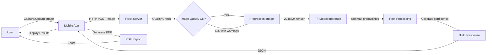

# 🌿 Plant Disease Detection via Few-Shot Learning
## Comprehensive Project Documentation

---

## 1. Project Overview

### 1.1 Problem Statement
Plant diseases cause **20-40% of global crop losses annually**, significantly impacting food security and the livelihoods of farmers. Traditional disease identification requires expert knowledge, which is not readily accessible to most farmers. This project develops an **AI-powered mobile application** that enables instant plant disease detection using a smartphone camera, along with a **Few-Shot Learning (FSL)** mechanism that allows the system to learn new diseases from minimal sample images.

### 1.2 Objectives
1. Build a deep learning model to classify **38 plant disease classes** across **15 crop species**
2. Develop a cross-platform mobile application for real-time disease detection
3. Implement Few-Shot Learning for recognizing new/emerging diseases with just 5-10 images
4. Provide actionable treatment and prevention recommendations
5. Generate downloadable PDF diagnostic reports

### 1.3 Scope
- **Input**: Leaf/plant images captured via smartphone camera or uploaded from gallery
- **Output**: Disease classification, confidence score, image quality assessment, symptoms, prevention measures, and downloadable PDF report
- **Supported Crops**: Apple, Blueberry, Cherry, Corn (Maize), Grape, Orange, Peach, Pepper, Potato, Raspberry, Soybean, Squash, Strawberry, Tomato (14 crops, 38 classes)

---

## 2. System Architecture

### 2.1 High-Level Architecture

```
┌─────────────────────────────────────────────────────────────────────┐
│                        MOBILE APPLICATION                           │
│                    (React Native + Expo SDK 54)                     │
│                                                                     │
│  ┌──────────┐  ┌──────────┐  ┌──────────┐  ┌────────────────────┐  │
│  │   Home   │  │ Capture  │  │  Result  │  │   Learn New (FSL)  │  │
│  │  Screen  │  │  Screen  │  │  Screen  │  │      Screen        │  │
│  └──────────┘  └──────────┘  └──────────┘  └────────────────────┘  │
│                       │                                             │
│              ┌────────▼────────┐                                    │
│              │   ML Service    │                                    │
│              │ (mlService.ts)  │                                    │
│              └────────┬────────┘                                    │
│                       │                                             │
│         ┌─────────────┴─────────────┐                              │
│         │                           │                              │
│  ┌──────▼──────┐          ┌────────▼─────────┐                    │
│  │   Online    │          │     Offline       │                    │
│  │   Mode      │          │   Fallback        │                    │
│  │ (HTTP API)  │          │ (Color Analysis)  │                    │
│  └──────┬──────┘          └──────────────────┘                    │
└─────────┼───────────────────────────────────────────────────────────┘
          │ HTTP POST (image/form-data)
          │
┌─────────▼───────────────────────────────────────────────────────────┐
│                       FLASK INFERENCE SERVER                         │
│                       (Python 3.x + Flask)                          │
│                                                                     │
│  ┌──────────────┐  ┌──────────────┐  ┌────────────────────────────┐ │
│  │   Image      │  │  TensorFlow  │  │   Post-Processing          │ │
│  │   Quality    │  │  Model       │  │   • Confidence Calibration │ │
│  │   Validator  │  │  (.keras)    │  │   • Top-3 Predictions      │ │
│  │              │  │  Inference   │  │   • Disease Info Lookup    │ │
│  └──────────────┘  └──────────────┘  └────────────────────────────┘ │
└─────────────────────────────────────────────────────────────────────┘
```

### 2.2 Technology Stack

| Layer | Technology | Version | Purpose |
|-------|-----------|---------|---------|
| **Mobile App** | React Native | 0.81.5 | Cross-platform UI framework |
| **App Platform** | Expo | SDK 54 | Build toolchain, camera, FS |
| **Language (App)** | TypeScript | 5.9 | Type-safe app development |
| **State Management** | Zustand | 5.0 | Lightweight app state |
| **Navigation** | React Navigation | 7.x | Tab + Stack navigation |
| **Backend** | Flask (Python) | 3.x | REST API server |
| **ML Framework** | TensorFlow / Keras | 2.x | Model training & inference |
| **Model Backbone** | MobileNetV2 / EfficientNetB3 | - | Transfer learning base |
| **Image Processing** | OpenCV, Pillow | - | Quality validation, preprocessing |
| **PDF Generation** | expo-print | 15.0 | HTML→PDF report generation |
| **Theme Persistence** | AsyncStorage | 2.1 | Save dark/light preference |

### 2.3 Communication Protocol

```
Mobile App ──── HTTP POST /predict ────► Flask Server
   │                                         │
   │    { multipart/form-data: image }       │
   │                                         │
   │◄──── JSON Response ────────────────────┘
   │
   │  {
   │    "class": "Tomato - Early Blight",
   │    "confidence": 64.3,
   │    "raw_confidence": 66.2,
   │    "symptoms": [...],
   │    "prevention": [...],
   │    "quality": { "score": 85, "issues": [] },
   │    "top_predictions": [...]
   │  }
```

---

## 3. Module Descriptions

### 3.1 Mobile Application Modules

#### 3.1.1 Screens (UI Layer)

| Screen | File | Description |
|--------|------|-------------|
| **HomeScreen** | `HomeScreen.tsx` | Dashboard with stats (38 diseases, 15 species, 95% accuracy), feature cards, quick access to Knowledge Hub & Few-Shot Learning, daily plant care tips |
| **CaptureScreen** | `CaptureScreen.tsx` | Camera viewfinder with grid overlay, gallery upload, image preview, and "DETECT DISEASE" trigger button |
| **ResultScreen** | `ResultScreen.tsx` | Displays diagnosis, confidence bar, image quality score, top predictions, symptoms, prevention steps, and PDF report generation |
| **LearnNewScreen** | `LearnNewScreen.tsx` | Few-Shot Learning interface: capture 5-10 images, start AI training, educational articles on plant care and disease prevention |
| **SpeciesScreen** | `SpeciesScreen.tsx` | Knowledge Hub with detailed disease information organized by plant species |
| **HistoryScreen** | `HistoryScreen.tsx` | Previous scan history with date, diagnosis, and confidence |
| **AboutScreen** | `AboutScreen.tsx` | App information, user guide, and how-to instructions |

#### 3.1.2 Services (Business Logic Layer)

| Service | File | Description |
|---------|------|-------------|
| **mlService** | `mlService.ts` | Primary inference coordinator. Routes predictions to online (server) or offline (local) mode. Handles image upload, response parsing, and fallback logic |
| **LocalMLService** | `LocalMLService.ts` | Offline fallback using JPEG decoding + color-based heuristic analysis (pixel ratio analysis for green, brown, yellow, etc.). Contains full disease database with symptoms/prevention for all 38 classes |

#### 3.1.3 Components (Reusable UI)

| Component | File | Description |
|-----------|------|-------------|
| **BottomTabBar** | `BottomTabBar.tsx` | Custom animated bottom navigation with Home, Detect (floating), About tabs |
| **FewShotCamera** | `FewShotCamera.tsx` | Multi-capture camera interface for Few-Shot Learning (5-10 images) |
| **RealisticHeroFallback** | `RealisticHeroFallback.tsx` | Animated hero section on HomeScreen |
| **GlassCard** | `GlassCard.tsx` | Glassmorphism card component |
| **ProgressRing** | `ProgressRing.tsx` | Circular progress indicator |
| **PremiumButton** | `PremiumButton.tsx` | Animated gradient button with haptics |
| **AnimatedBackground** | `AnimatedBackground.tsx` | Floating particle animations |
| **Leaf3DScanner** | `Leaf3DScanner.tsx` | 3D leaf scanning animation |

#### 3.1.4 State & Context

| Module | File | Description |
|--------|------|-------------|
| **Zustand Store** | `store/index.ts` | Global state: `isModelReady`, `history[]`, `lastPrediction` |
| **ThemeContext** | `context/ThemeContext.tsx` | Dark/Light mode toggle with AsyncStorage persistence. Two complete themes (light: Emerald palette, dark: Slate palette) |

### 3.2 Backend Server Modules

#### 3.2.1 Flask Server (`server.py`)

| Module/Function | Lines | Description |
|----------------|-------|-------------|
| **Model Loading** | 1-35 | Loads `.keras` model and `class_names.json` at startup |
| **DISEASE_INFO Database** | 36-280 | Hardcoded symptoms & prevention for all 38 disease classes |
| **Image Quality Validation** | `validate_image_quality()` | Checks brightness, contrast, sharpness (Laplacian variance), green content (plant detection), image dimensions |
| **Preprocessing** | `preprocess_image()` | CLAHE lighting normalization, smart crop, resize to 224×224, optional enhancement |
| **Test-Time Augmentation** | `get_multi_crop_predictions()` | Multi-crop inference (center, 4 corners) averaged for robust prediction |
| **Confidence Calibration** | `calibrate_confidence()` | Adjusts raw model confidence using normalized entropy and quality score |
| **Entropy Calculation** | `calculate_entropy()` | Shannon entropy over softmax probabilities for uncertainty measurement |

#### 3.2.2 API Endpoints

| Endpoint | Method | Description |
|----------|--------|-------------|
| `GET /health` | GET | Health check: model status, version, feature list |
| `POST /predict` | POST | Main prediction: accepts image, returns diagnosis + confidence + quality + top-3 |
| `POST /validate` | POST | Image quality check without prediction |
| `GET /classes` | GET | Returns all 38 supported disease class names |

### 3.3 ML Pipeline Modules

| Script | Description |
|--------|-------------|
| `train_plantvillage_model.py` | Primary training script: MobileNetV2 backbone, 2-phase transfer learning, ImageDataGenerator with augmentation |
| `train_enhanced_model.py` | Enhanced training: EfficientNetB3 backbone, focal loss, cosine annealing LR, cutout augmentation, class weights |
| `few_shot_prototype.py` | Prototypical Networks FSL: extracts embeddings via feature extractor, computes class prototypes, classifies via cosine similarity |
| `dataset_loader.py` | PlantVillage dataset loading with train/val/test splits |
| `evaluate.py` | Model evaluation: loss, accuracy, classification report, confusion matrix |
| `export_model.py` | Export trained model to TFLite for mobile deployment |

---

## 4. System Analysis

### 4.1 Functional Requirements

| ID | Requirement | Priority |
|----|------------|----------|
| FR-01 | Capture plant leaf images via camera | High |
| FR-02 | Upload images from device gallery | High |
| FR-03 | Detect and classify 38 plant diseases | High |
| FR-04 | Display confidence score with visual indicator | High |
| FR-05 | Display image quality score and issues | Medium |
| FR-06 | Show symptoms of detected disease | High |
| FR-07 | Provide prevention/treatment recommendations | High |
| FR-08 | Generate downloadable PDF diagnostic report | Medium |
| FR-09 | Maintain scan history | Medium |
| FR-10 | Support dark/light theme modes | Low |
| FR-11 | Few-Shot Learning: train on new diseases with 5-10 images | High |
| FR-12 | Knowledge Hub with disease information | Medium |
| FR-13 | Offline fallback prediction capability | Medium |

### 4.2 Non-Functional Requirements

| ID | Requirement | Specification |
|----|------------|---------------|
| NFR-01 | Response time | < 3 seconds for prediction |
| NFR-02 | Model accuracy | ≥ 90% on validation set |
| NFR-03 | App compatibility | Android (API 21+), iOS (13+) |
| NFR-04 | Image resolution | Minimum 100×100 pixels |
| NFR-05 | Network dependency | Server mode requires LAN; offline mode available |
| NFR-06 | Model size | ~10 MB (Keras), ~5 MB (TFLite) |

### 4.3 Data Flow Diagram (DFD Level 1)



### 4.4 Use Case Diagram

```
┌────────────────────────────────────────────────────────┐
│                  Plant Disease Detection App            │
│                                                         │
│  ┌─────────────────────────────────────────────────┐   │
│  │  UC-01: Capture Leaf Image                       │   │
│  │  UC-02: Upload Image from Gallery                │   │
│  │  UC-03: Detect Plant Disease                     │   │
│  │  UC-04: View Diagnosis Results                   │   │
│  │  UC-05: View Image Quality Score                 │   │
│  │  UC-06: Download PDF Report                      │   │
│  │  UC-07: Browse Knowledge Hub                     │   │
│  │  UC-08: Train AI on New Disease (Few-Shot)       │   │
│  │  UC-09: View Scan History                        │   │
│  │  UC-10: Toggle Dark/Light Theme                  │   │
│  └─────────────────────────────────────────────────┘   │
│         ▲                                               │
│         │ interacts                                     │
└─────────┼───────────────────────────────────────────────┘
          │
     ┌────┴────┐
     │  Farmer │
     │  (User) │
     └─────────┘
```

---

## 5. System Design

### 5.1 Deep Learning Model Architecture

```
Input Image (224 × 224 × 3)
        │
        ▼
┌─────────────────────────────┐
│     MobileNetV2 Backbone     │  ← Pre-trained on ImageNet (1.4M images)
│   (Feature Extraction)       │     1,000 classes → frozen initially
│   154 layers, 2.2M params   │
└──────────────┬──────────────┘
               │ 7 × 7 × 1280 feature maps
               ▼
┌──────────────────────────────┐
│   Global Average Pooling 2D  │  → 1280-dim vector
├──────────────────────────────┤
│   Batch Normalization        │
├──────────────────────────────┤
│   Dropout (0.5)              │  ← Regularization
├──────────────────────────────┤
│   Dense (512, ReLU)          │  ← L2 regularization (0.001)
├──────────────────────────────┤
│   Batch Normalization        │
├──────────────────────────────┤
│   Dropout (0.3)              │
├──────────────────────────────┤
│   Dense (256, ReLU)          │
├──────────────────────────────┤
│   Batch Normalization        │
├──────────────────────────────┤
│   Dropout (0.2)              │
├──────────────────────────────┤
│   Dense (38, Softmax)        │  → 38 class probabilities
└──────────────────────────────┘
```

### 5.2 Training Strategy

```
Phase 1: Transfer Learning (10 epochs)
├── Frozen MobileNetV2 backbone
├── Adam optimizer (lr = 0.001)
├── Categorical Cross-Entropy loss
├── Data augmentation: rotation, shift, shear, zoom, flip
└── ModelCheckpoint + EarlyStopping + ReduceLROnPlateau

Phase 2: Fine-Tuning (10 epochs)
├── Unfreeze top layers of MobileNetV2 (layers 100+)
├── Adam optimizer (lr = 0.0001) — 10x lower
├── Continue training with same augmentation
└── Best model saved based on val_accuracy
```

### 5.3 Enhanced Training (EfficientNetB3 variant)

| Feature | Description |
|---------|-------------|
| Backbone | EfficientNetB3 (more accurate than MobileNetV2) |
| Loss Function | Focal Loss (γ=2.0, α=0.25) for class imbalance |
| Label Smoothing | 0.1 — prevents overconfident predictions |
| LR Schedule | Cosine Annealing (smooth decay) |
| Augmentation | Standard + Random Cutout + Color Jitter + Gaussian Noise |
| Class Weights | Inverse frequency weighting (capped at 3.0) |
| Fine-tuning | Top 30% of backbone layers unfrozen |

### 5.4 Few-Shot Learning (Prototypical Networks)

```
┌──────────────────────────────────────────────────────────┐
│                  PROTOTYPICAL NETWORK                     │
│                                                          │
│  1. Feature Extraction                                    │
│     Full Model → Remove classification head               │
│     Output: GlobalAvgPooling → 1280-dim embedding        │
│                                                          │
│  2. Support Set (5-10 images per class)                   │
│     Extract embeddings for each support image             │
│     Compute PROTOTYPE = mean(embeddings) per class       │
│                                                          │
│  3. Query Classification                                  │
│     Extract embedding for query image                     │
│     Find nearest prototype via COSINE SIMILARITY         │
│     Predicted class = argmax(similarity)                  │
│                                                          │
│  Distance Metric: Cosine Similarity                       │
│  sim(q, p) = (q · p) / (||q|| × ||p||)                  │
└──────────────────────────────────────────────────────────┘
```

### 5.5 Image Quality Validation Pipeline

```
Input Image
    │
    ├─► Brightness Check (avg pixel value)
    │   • Min: 30, Max: 240
    │   • Score: 100 if in range, penalized otherwise
    │
    ├─► Contrast Check (pixel std deviation)
    │   • Min: 25
    │   • Low contrast → washed-out image
    │
    ├─► Sharpness Check (Laplacian variance)
    │   • Min: 100
    │   • Low variance → blurry image
    │
    ├─► Green Content Detection
    │   • Checks if image contains plant material
    │   • Uses HSV color space (H: 35-85°)
    │
    ├─► Dimension Check
    │   • Minimum: 100×100 pixels
    │
    └─► Composite Quality Score (0-100%)
        • Weighted average of all factors
        • Issues list: ["Image too dark", "Image blurry", etc.]
        • Suggestions: ["Take photo in better lighting", etc.]
```

### 5.6 Confidence Calibration

```
calibrated = raw_confidence × quality_factor × entropy_factor

Where:
  • raw_confidence = model softmax probability × 100
  • max_entropy = ln(38) ≈ 3.64  (uniform distribution over 38 classes)
  • normalized_entropy = entropy / max_entropy  (0 to 1)
  • entropy_factor = 1.0 − (normalized_entropy²) × 0.4  (max 40% penalty)
  • quality_factor = 0.7 + 0.3 × (quality_score / 100)  (range: 0.7–1.0)
```

---

## 6. Database / Data Design

### 6.1 Dataset: PlantVillage

| Property | Value |
|----------|-------|
| **Total Images** | ~54,000+ images |
| **Classes** | 38 (healthy + diseased) |
| **Crop Species** | 14 |
| **Image Size** | 256×256 (resized to 224×224) |
| **Format** | JPEG |
| **Split** | 80% Training / 20% Validation |

### 6.2 Supported Disease Classes (38 Total)

| # | Class Name | Type |
|---|-----------|------|
| 1 | Apple — Apple Scab | Fungal |
| 2 | Apple — Black Rot | Fungal |
| 3 | Apple — Cedar Apple Rust | Fungal |
| 4 | Apple — Healthy | - |
| 5 | Blueberry — Healthy | - |
| 6 | Cherry — Powdery Mildew | Fungal |
| 7 | Cherry — Healthy | - |
| 8 | Corn — Gray Leaf Spot | Fungal |
| 9 | Corn — Common Rust | Fungal |
| 10 | Corn — Northern Leaf Blight | Fungal |
| 11 | Corn — Healthy | - |
| 12 | Grape — Black Rot | Fungal |
| 13 | Grape — Esca (Black Measles) | Fungal |
| 14 | Grape — Leaf Blight | Fungal |
| 15 | Grape — Healthy | - |
| 16 | Orange — Citrus Greening (HLB) | Bacterial |
| 17 | Peach — Bacterial Spot | Bacterial |
| 18 | Peach — Healthy | - |
| 19 | Pepper Bell — Bacterial Spot | Bacterial |
| 20 | Pepper Bell — Healthy | - |
| 21 | Potato — Early Blight | Fungal |
| 22 | Potato — Late Blight | Fungal |
| 23 | Potato — Healthy | - |
| 24 | Raspberry — Healthy | - |
| 25 | Soybean — Healthy | - |
| 26 | Squash — Powdery Mildew | Fungal |
| 27 | Strawberry — Leaf Scorch | Fungal |
| 28 | Strawberry — Healthy | - |
| 29 | Tomato — Bacterial Spot | Bacterial |
| 30 | Tomato — Early Blight | Fungal |
| 31 | Tomato — Late Blight | Fungal |
| 32 | Tomato — Leaf Mold | Fungal |
| 33 | Tomato — Septoria Leaf Spot | Fungal |
| 34 | Tomato — Spider Mites | Pest |
| 35 | Tomato — Target Spot | Fungal |
| 36 | Tomato — Yellow Leaf Curl Virus | Viral |
| 37 | Tomato — Mosaic Virus | Viral |
| 38 | Tomato — Healthy | - |

### 6.3 Client-side Data Storage

| Store | Technology | Data |
|-------|-----------|------|
| **App State** | Zustand (in-memory) | `isModelReady`, `lastPrediction`, `history[]` |
| **Theme Preference** | AsyncStorage | `theme: "dark" \| "light"` |
| **Images** | Expo FileSystem | Cached captured/uploaded images |

---

## 7. User Interface Design

### 7.1 Navigation Structure

```
App (ThemeProvider)
 └── NavigationContainer
      └── BottomTabNavigator
           ├── HomeTab (StackNavigator)
           │    ├── HomeScreen
           │    ├── Knowledge Hub (SpeciesScreen)
           │    ├── Learn New (LearnNewScreen)
           │    └── History (HistoryScreen)
           │
           ├── DetectTab (StackNavigator)
           │    ├── CaptureScreen
           │    └── ResultScreen
           │
           └── AboutTab (StackNavigator)
                └── AboutScreen
```

### 7.2 Design System

| Token | Light Mode | Dark Mode |
|-------|-----------|-----------|
| Primary | `#059669` (Emerald 600) | `#10B981` (Emerald 500) |
| Background | `#F0FDF4` (Emerald 50) | `#0F172A` (Slate 900) |
| Surface | `#FFFFFF` | `#1E293B` (Slate 800) |
| Text | `#064E3B` (Emerald 900) | `#F0FDF4` (Emerald 50) |
| Accent | `#F59E0B` (Amber) | `#FBBF24` (Amber 300) |
| Error | `#EF4444` (Red 500) | `#F87171` (Red 400) |

### 7.3 Key UI Features
- **Dark/Light Mode**: Persistent toggle (floating button) with AsyncStorage, smooth transition
- **Animated Hero Section**: Particle background, growing tree animation on HomeScreen
- **Grid Overlay**: Camera viewfinder with rule-of-thirds grid for better framing
- **Progress Bars**: Colored confidence & quality score indicators (Green > 80%, Amber > 50%, Red < 50%)
- **PDF Report**: Professional A4 report with embedded base64 image, gradient header, metrics cards, styled lists

---

## 8. Testing Strategy

### 8.1 Model Testing

| Test Type | Methodology | Metric |
|-----------|------------|--------|
| **Validation Accuracy** | 20% holdout from training set | ≥ 90% |
| **Top-3 Accuracy** | Correct class in top 3 predictions | ≥ 97% |
| **Confusion Matrix** | Per-class precision/recall/F1 | `evaluate.py` |
| **Cross-Validation** | k-fold on training data | Consistency check |

### 8.2 Image Quality Testing

| Test Case | Input | Expected Output |
|-----------|-------|-----------------|
| Normal leaf image | Well-lit, focused leaf | Quality ≥ 80%, no issues |
| Dark image | Avg brightness < 30 | "Image too dark" warning |
| Blurry image | Laplacian variance < 100 | "Image is blurry" warning |
| No plant content | Random non-plant photo | "Low plant content" warning |
| Very small image | 50×50 pixels | "Image too small" warning |

### 8.3 API Testing

| Endpoint | Test | Expected |
|----------|------|----------|
| `GET /health` | Server running check | `{"status": "healthy", "model_loaded": true}` |
| `POST /predict` | Valid leaf image | 200 + JSON with class, confidence, symptoms |
| `POST /predict` | No image | 400 + `{"error": "No image uploaded"}` |
| `POST /predict` | Corrupt file | 500 + error message |
| `POST /validate` | Quality check only | 200 + quality score + issues |
| `GET /classes` | List classes | 200 + 38 class names |

### 8.4 Mobile App Testing

| Test Area | Test Cases |
|-----------|-----------|
| **Camera** | Permission request, capture, preview display, retake |
| **Gallery** | Image picker, file format support, preview |
| **Navigation** | Tab switching, stack push/pop, deep links |
| **Result Display** | Confidence bar rendering, symptoms list, prevention list |
| **Quality Display** | Score bar, issues list, suggestions |
| **PDF Generation** | Image embedding, layout, sharing dialog |
| **Theme** | Toggle switch, persistence across restarts |
| **Offline Mode** | Server unavailable → fallback activates |
| **History** | Add prediction, display list, persistence |

### 8.5 Integration Testing

| Test | Steps | Expected |
|------|-------|----------|
| **End-to-End Flow** | Capture image → Send to server → Display result → Generate PDF | Full success path |
| **Server Down** | Kill server → Capture image → Analyze | Fallback to offline mode with notice |
| **Large Image** | Upload 4000×3000 photo | Server resizes to 224×224, normal response |
| **Rapid Requests** | Send 5 images quickly | All processed, no crashes |

---

## 9. Deployment Architecture

### 9.1 Development Environment

```
┌─────────────────────────────────────────┐
│          Developer Machine               │
│                                          │
│  ┌──────────┐     ┌──────────────────┐  │
│  │  Expo    │     │  Flask Server    │  │
│  │  Dev     │     │  (port 5000)     │  │
│  │  Server  │     │                  │  │
│  │(port 8081)│    │  model.keras     │  │
│  └────┬─────┘     └────────┬─────────┘  │
│       │                     │            │
│       │     LAN / WiFi      │            │
│       └──────────┬──────────┘            │
└──────────────────┼───────────────────────┘
                   │
           ┌───────▼───────┐
           │  Android/iOS  │
           │    Device     │
           │  (Expo Go)    │
           └───────────────┘
```

### 9.2 Production Deployment Options

| Option | Description | Pros | Cons |
|--------|-------------|------|------|
| **Local Server** | Flask on same LAN | No internet needed, low latency | Limited to local network |
| **Cloud Deploy** | Flask on AWS/GCP/Azure | Accessible anywhere | Requires internet, hosting cost |
| **On-Device (TFLite)** | Embedded model in app | Fully offline, fastest | Larger app size, less powerful model |

---

## 10. Key Algorithms

### 10.1 Transfer Learning
Pre-trained MobileNetV2 (ImageNet) is used as a fixed feature extractor initially, then fine-tuned. This allows training a 38-class classifier with only ~54,000 images instead of millions.

### 10.2 Few-Shot Learning (Prototypical Networks)
For novel disease detection: extract feature embeddings from the pre-trained model's penultimate layer, compute class prototypes (mean embeddings), and classify new images by finding the nearest prototype via cosine similarity.

### 10.3 Test-Time Augmentation (TTA)
Multiple crops (center + 4 corners) of the input image are processed independently, and predictions are averaged. Improves robustness against slight variations in image framing.

### 10.4 CLAHE (Contrast Limited Adaptive Histogram Equalization)
Applied during preprocessing to normalize lighting conditions. Converts image to LAB color space, applies CLAHE to the L channel, and converts back to RGB.

### 10.5 Focal Loss
For the enhanced training variant: addresses class imbalance by down-weighting well-classified examples and focusing training on hard, misclassified samples.

---

## 11. Project File Structure

```
plant_disease_FSL/
├── server.py                            # Flask inference server (main)
├── best_model.keras                     # Trained model checkpoint
├── plant_disease_model_plantvillage.keras # PlantVillage-trained model
├── class_names_plantvillage.json        # 38 class names
├── class_names.txt                      # Class names (text format)
├── train_plantvillage_model.py          # Training script (MobileNetV2)
├── requirements.txt                     # Python dependencies
│
├── ml_pipeline/                         # ML training & evaluation
│   ├── train_enhanced_model.py          # Enhanced training (EfficientNetB3)
│   ├── few_shot_prototype.py            # Prototypical Network FSL
│   ├── dataset_loader.py               # Dataset loading utilities
│   ├── evaluate.py                      # Model evaluation & metrics
│   ├── export_model.py                  # TFLite conversion
│   └── train_model.py                   # Basic training script
│
├── PlantDiseaseApp/                     # React Native mobile app
│   ├── App.tsx                          # Root component, navigation setup
│   ├── package.json                     # Node.js dependencies
│   ├── app.json                         # Expo configuration
│   │
│   └── src/
│       ├── theme.ts                     # Design tokens
│       ├── screens/                     # UI screens (7 active screens)
│       │   ├── HomeScreen.tsx
│       │   ├── CaptureScreen.tsx
│       │   ├── ResultScreen.tsx
│       │   ├── LearnNewScreen.tsx
│       │   ├── SpeciesScreen.tsx
│       │   ├── HistoryScreen.tsx
│       │   └── AboutScreen.tsx
│       ├── components/                  # Reusable UI components (13 files)
│       │   ├── BottomTabBar.tsx
│       │   ├── FewShotCamera.tsx
│       │   ├── GlassCard.tsx
│       │   └── ... (10 more)
│       ├── services/                    # Business logic
│       │   ├── mlService.ts             # Online inference service
│       │   └── LocalMLService.ts        # Offline fallback
│       ├── store/
│       │   └── index.ts                 # Zustand global state
│       └── context/
│           └── ThemeContext.tsx          # Dark/light theme provider
```

---

## 12. Future Enhancements

1. **Cloud Deployment** — Deploy Flask server to AWS/GCP for internet-accessible predictions
2. **On-Device Inference** — TFLite model embedded in the app for fully offline, internet-free operation
3. **Real-time Camera Detection** — Live disease detection in camera viewfinder (stream-based)
4. **Multi-language Support** — Hindi, Spanish, etc. for global farmer accessibility
5. **GPS + Weather Integration** — Correlate disease outbreaks with geographic and weather data
6. **Community Disease Reporting** — Crowdsource new disease observations to build regional datasets
7. **Severity Estimation** — Not just disease type, but severity level (early/moderate/severe)
8. **Push Notifications** — Seasonal disease alerts based on crop type and region

---

## 13. References

1. **PlantVillage Dataset** — Hughes, D.P., Salathé, M. (2015). "An open access repository of images on plant health to enable the development of mobile disease diagnostics."
2. **MobileNetV2** — Sandler, M. et al. (2018). "MobileNetV2: Inverted Residuals and Linear Bottlenecks." IEEE CVPR.
3. **EfficientNet** — Tan, M., Le, Q.V. (2019). "EfficientNet: Rethinking Model Scaling for Convolutional Neural Networks." ICML.
4. **Prototypical Networks** — Snell, J., Swersky, K., Zemel, R. (2017). "Prototypical Networks for Few-shot Learning." NeurIPS.
5. **TensorFlow** — Abadi, M. et al. (2015). [https://www.tensorflow.org](https://www.tensorflow.org)
6. **React Native** — Meta Platforms. [https://reactnative.dev](https://reactnative.dev)
7. **Expo** — Expo Team. [https://expo.dev](https://expo.dev)

---

*Document generated for Major Project presentation preparation.*
*Last updated: March 2026*
